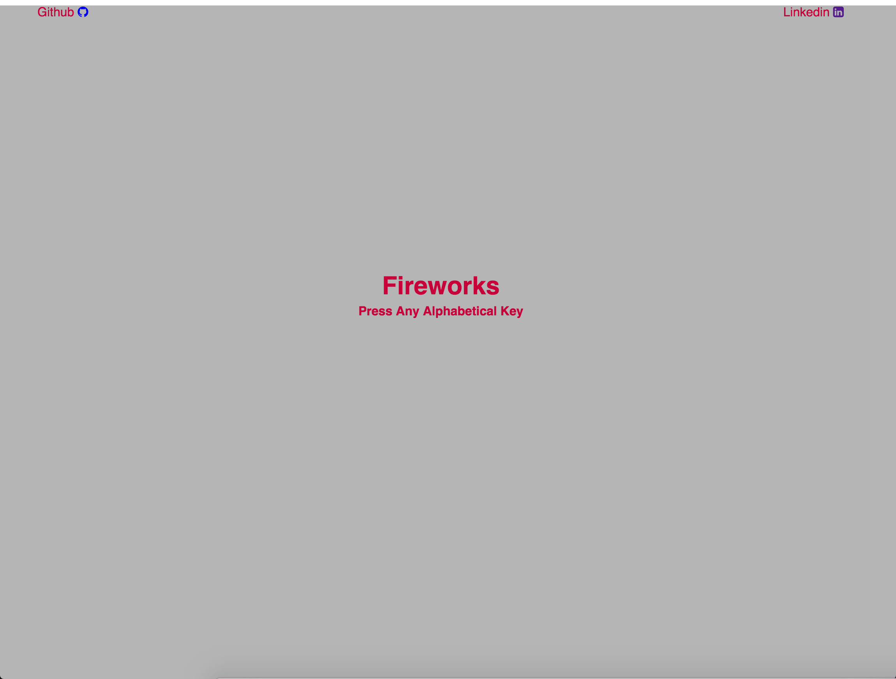

# Fireworks

[live](https://tonycweng.github.io/fireworks/)

## Instructions

Fireworks is rather straight-forward: on alphabetical keyclicks, an animation will render on the screen alongside some sound effect. Use the spacebar or z key to remove all ongoing animations.



## Technology

The animations were implemented via HTML5 Canvas. Objects are "animated" by calling their update function, which clears the canvas of their previous location and shifts properties such as position or width/radius/length. Objects to be animated are entered into an animations array. The animate function calls upon the update function of every object stored inside this animations array. Objects are removed when their animation finishes or when a set amount of time passes.

```Javascript
function animate() {
  console.log("abc");
  ctx.clearRect(0, 0, innerWidth, innerHeight);
  for (var k = 0; k < animations.length; k++) {
    animations[k].update();
  }
  setTimeout(function() {
    requestAnimationFrame(animate);
  }, 15);
}
```


```Javascript
document.addEventListener("keydown", (function(e) {

  let howl = new Howl({src: music[e.keyCode]}).play();

  switch(e.keyCode) {
    case 65:
      animations.push(circle1);
      setTimeout(removeAnimation.bind(null, circle1), 2000);
  }
)}
```

Sound was handled through the use of an external library, Howler.js.

## Future Implementations

[ ] Touch up on animations through the use of an eternal library.
[ ] The ability to record one's creation.
