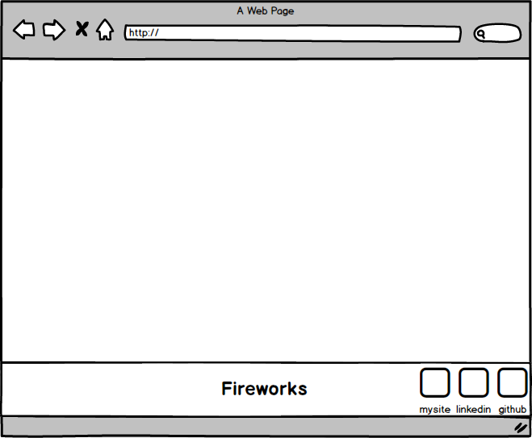

# Proposal
[Fireworks Live](tbd)

## Background
Fireworks is a fun single screen game that will simply allow users to witness a variety of fireworks and other animation effects through keystrokes. Aside from the titular fireworks, there should be a number of other visually appealing effects (screen flashes, background color changes, shooting stars, etc.).

## Minimum Viable Product
Fireworks should have the following features:

- There should be a display informing users to click on Alphabetic keystrokes.
- Predetermined keys should cause a firework animation to occur alongside an appropriate sound.
- Animations should fade away and not persist on screen.
- Certain keystrokes should have a pool of animation variations to occur. Consistent sound per key.

There should also be an appropriate production Readme.

## Wireframe

This particular app will feature only a single display, alongside navlinks to my github, linkedin, and personal site.

## Technologies

This project will require the following technologies to implement:
- Javascript and `jquery` for firework logic and binding keypresses to fireworks.
- `howler.js` for keypresses to additionally cause some sound to play alongside the firework.
- `easel.js` to more easily create base shapes and images.
- `anime.js` to animate these shapes.

## Timeline

### Day 1: Setup and Begin Animations
**Objective:** Basic javascript project setup. Setup `webpack.config.js`, entry file, `package.json.` Install `howler.js` and `anime.js`. Learn `anime.js` and create a number of suitable animations.

### Day 2: Animations
**Objective:** Continue working on animations as needed.

### Day 3: Event Logic and Continue Animations
**Objective:** Finish animation creations and map keystrokes to fireworks.

### Day 4: Add Sound
**Objective:** Add appropriate sound effects to animations.

### Bonus features

- [ ] Add persistent nightsky background (clouds, moon, sun) and keybinds to alter it.
- [ ] Finetune animations.
